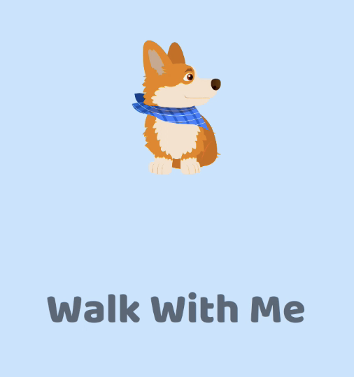
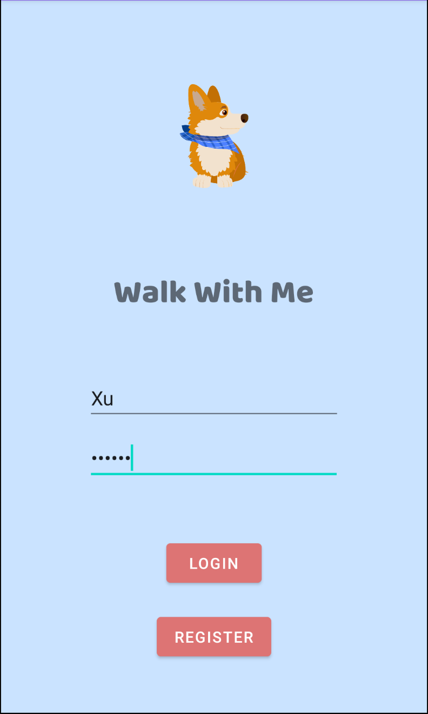
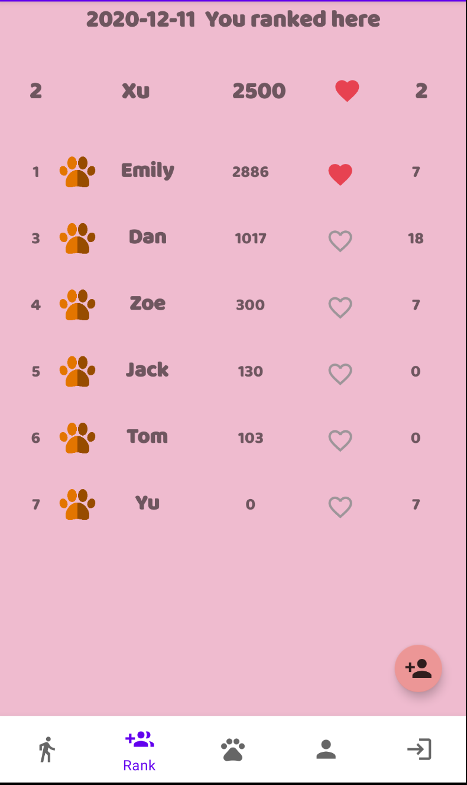
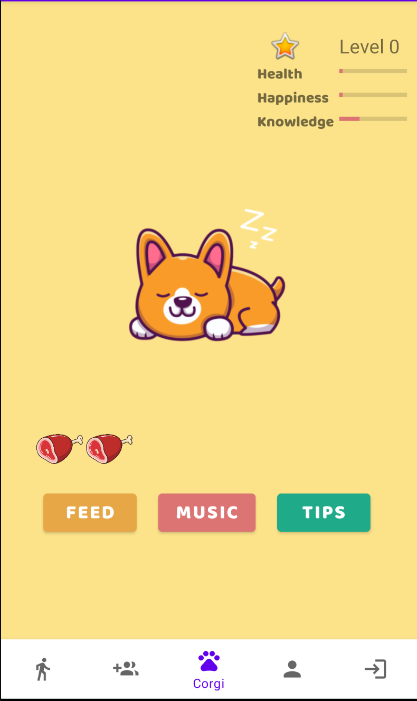
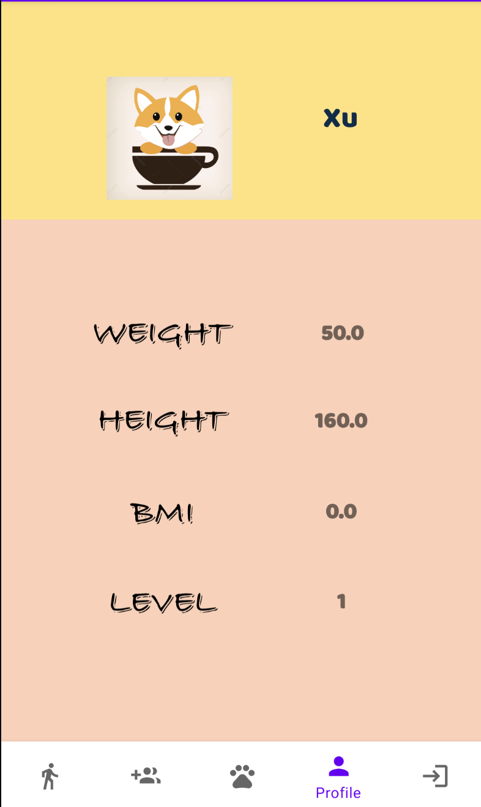

  

# WalkWithMe

Do you think walking along is too boring?
Do you want to walk but need more motivation?
Then Walk With Me is for you! Walk With Me is a FREE step counter app. It tracks your steps using your phone’s built-in pedometer.
Track your steps, adopt a virtual pet, join group challenges, and accomplish together with your friends and family. Walk With Me makes it fun to keep healthy.

**Adopt a Dog**

-When you download the Walk With Me, choose and name your virtual dog
 -The more steps you take, the happier your dog will be
 -Your dog will show different reactions when you accomplish different step goals -Your dog will receive more bones when you walk more steps. That is your dog’s favorite treat

\- Receive fun notifications from your dog

**Friends & Family**

-Easy to add your friends and family
-Hold each other accountable

**Simple**

-No ads
-No need to keep the app open while you’re walking -Clean and succinct interface

**Now, let’s Walk With Me!**

# Key features

-Pedometer:  app tracks your daily steps using your Android's built-in pedometer. An intercative line chart will show the steps history in past 7 days

-Step ranking: 
- Dispaly users' steps and ranking among all the friends.
- Respond to friends' steps recordings.
- Add a new friend.

-Vitural pet

Pet Section
====
- Three Objectives for the Pet Section in this App:
  - 1) It is designed for increasing the user engagement through interesting interaction with a virtual pet.
  - 2) It is designed for motivating user's fitness activity through the feature of "walking for earnining your pet's food".
  - 3) It is designed for a preliminary test on the integration of music-listening features and news-reading features in a fitness management app. 
  
- The user engagement will be embodied in these five aspects:
  - Owning: You will own a cute a cartoon Pet corgi who will accompany your exercise. Once you touch it, it will run. If there is no interaction for a while, the pet will go back to sleep.
  - Feeding: Every 500 more steps you walk, you will earn one piece of meat. Feeding your pet three times a day will prevent its starving. Once you feed your pet, the value of the health property of your pet will increase.
  - Listening: Pet corgi likes music. Once you listen to the music, the happiness value of the pet will increase. Hope the music can motivate your daily fitness as well as enrich your walking journey.
  - Reading: The more read the tips, the greater value of your pet's knowledge indicator will be. Reading tips is not only a good way to know more about your pet, but also a good way to gain more knowledge of fitness.
  - Challenging: It is an upgrade game. Pet's level is allowed to upgrade if three main attributes' values are all achieved 100. The more you walk and interact with the pet, the faster your pet's level will be upgraded.

# Walk through

  
   
  
  

   
   
  
  
  

# Developed by

Xiaoqing Hua

Yu Fan

Xu Yuan

Dan Yin

# Reference
- Musics are credit from
- Happy by Mike Leite https://soundcloud.com/mikeleite
- I Don't Care by Declan DP https://soundcloud.com/declandp
- Mamacita (instrumental) by Mike Leite https://soundcloud.com/mikeleite

